# YGGDRASIL_OS 团队协作系统

YGGDRASIL_OS 是一个面向 CTF / 电子数据取证比赛的团队协作平台。YGGDRASIL 取自北欧神话中的“世界树”，在本项目中象征团队成员、题目线索、答案记录和 Writeup 共同生长的协作网络。

项目采用前后端分离架构，前端提供比赛、题目、答案、Writeup 和备注的协作看板，后端负责用户认证、题目数据、文件上传、实时刷新和 Excel 批量处理。

## 功能概览

- 比赛管理：创建比赛、查看比赛列表、进入单场比赛协作空间。
- 题目管理：支持手动创建题目，也支持通过 Excel 批量导入题目。
- 团队协作：每道题可以提交答案、Writeup、备注和附件。
- 实时刷新：后端通过 SSE 推送刷新事件，团队成员无需手动刷新页面。
- 答案统计：自动统计同一道题不同答案的分布，并显示一致率最高的候选答案。
- 文件上传：Writeup 支持上传图片和压缩包等附件，图片可直接预览。
- 点赞互动：Writeup 和备注支持点赞。
- 管理操作：管理员可以编辑、删除、置顶题目，也可以删除比赛。
- Excel 流程：支持下载提交模板、批量回传答案/WP/备注、导出协作表。
- 主题切换：前端内置明暗主题切换。

## 文档与演示素材

- 独立手册源文件：[docs/USER_MANUAL_GITHUB_TEMPLATE.md](docs/USER_MANUAL_GITHUB_TEMPLATE.md)
- 测试题目 Excel：[docs/testdata/yggdrasil_sample_tasks.xlsx](docs/testdata/yggdrasil_sample_tasks.xlsx)
- 操作截图资源：`docs/USER_MANUAL_GITHUB_TEMPLATE.assets/`
- 环境变量示例：根目录 `.env.example` 与 `frontend/.env.example`

## 技术栈

| 模块 | 技术 |
| --- | --- |
| 前端 | Vue 3、Vite、Vue Router、Axios、SheetJS/xlsx |
| 后端 | Python、Flask、Flask-SQLAlchemy、Flask-CORS |
| 数据库 | SQLite |
| Excel 处理 | pandas、openpyxl |
| 实时通信 | Server-Sent Events |

## 目录结构

```text
YGGDRASIL_OS/
├── backend/
│   ├── app.py                 # Flask 入口、API 路由、SSE 推送
│   ├── models.py              # SQLAlchemy 数据模型
│   ├── recreate_db.py         # 重建数据库脚本，会清空原数据
│   ├── requirements.txt       # Python 依赖
│   ├── instance/              # Flask 默认 SQLite 数据库存放目录
│   └── uploads/               # 用户上传的 Writeup 附件
├── frontend/
│   ├── index.html
│   ├── package.json
│   ├── vite.config.js         # Vite 配置，当前开发端口为 3000
│   └── src/
│       ├── App.vue
│       ├── main.js
│       ├── router/
│       ├── components/
│       └── views/
├── docs/
│   ├── USER_MANUAL_GITHUB_TEMPLATE.md
│   ├── USER_MANUAL_GITHUB_TEMPLATE.assets/
│   └── testdata/
├── start_backend.bat          # Windows 后端启动脚本
├── start_frontend.bat         # Windows 前端启动脚本
└── README.md
```

## 环境要求

- Node.js 18 或更新版本
- Python 3.8 到 3.11
- Windows、macOS 或 Linux 均可运行；当前仓库内的 `.bat` 脚本主要面向 Windows

## 快速启动

### 1. 启动后端

```powershell
cd "<项目目录>\backend"
python -m venv .venv
.\.venv\Scripts\activate
pip install -r requirements.txt
python app.py
```

后端默认运行在：

```text
http://localhost:5000
```

也可以双击根目录的 `start_backend.bat`。脚本会优先使用 `backend/.venv` 中的 Python；如果没有虚拟环境，则使用系统 PATH 中的 `python`。

### 2. 启动前端

```powershell
cd "<项目目录>\frontend"
npm install
npm run dev
```

前端开发服务端口在 `frontend/vite.config.js` 中配置为：

```text
http://localhost:3000
```

也可以双击根目录的 `start_frontend.bat`。

### 3. 配置后端地址

前端默认请求：

```text
http://localhost:5000
```

如需连接其他后端地址，可在 `frontend/.env.local` 中添加：

```env
VITE_API_URL=http://localhost:5000
```

仓库中提供了 `frontend/.env.example` 作为前端配置模板，根目录 `.env.example` 则记录后端可用的 `YGGDRASIL_*` 环境变量。

## 默认账号

管理员账号：

```text
用户名：admin
密码：123456
```

注册邀请码：

```text
xjxy666
```

说明：系统启动时会自动确保默认管理员和默认邀请码存在。密码现在会以哈希形式存储；已有旧明文密码用户在成功登录后会自动升级为哈希密码。正式部署前建议通过环境变量或管理后台修改默认管理员密码和默认邀请码。

## 操作手册

### 1. 系统简介

YGGDRASIL_OS 面向 CTF / 电子数据取证比赛场景，提供比赛管理、题目导入、答案协作、Writeup 沉淀、附件管理和管理员控制台。YGGDRASIL 取自北欧神话中的世界树，也代表团队协作中多条线索向同一目标汇聚。

核心流程：

1. 管理员创建比赛行动。
2. 管理员或成员通过 Excel / 手动方式导入题目。
3. 团队成员在协作大表中提交答案、WP、备注和附件。
4. 系统统计答案一致率，并保留审计日志与附件下载入口。

### 2. 登录与注册

用户进入系统后会看到登录面板；新成员需要邀请码才能注册。

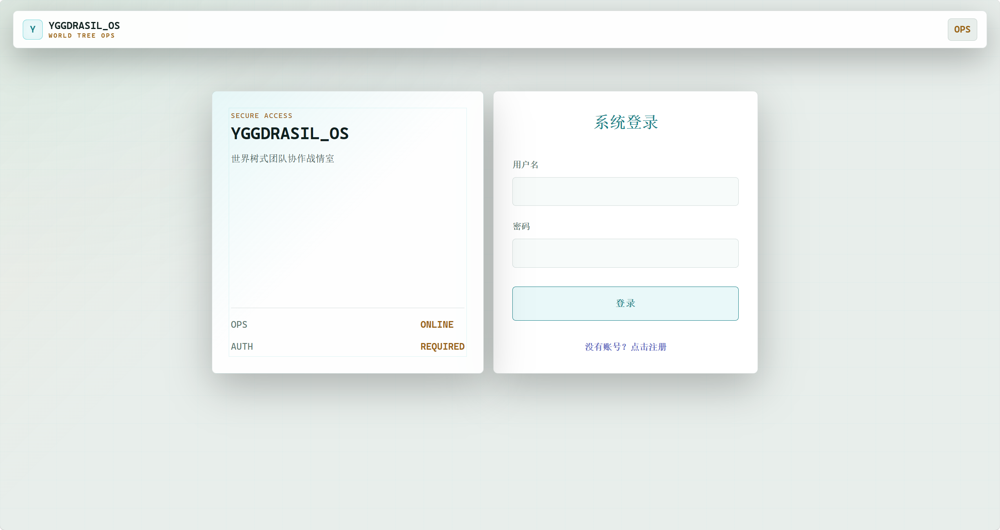

### 3. 控制中心

登录后进入控制中心，可快速进入比赛行动和题目上传页面。顶部导航展示当前用户和角色。

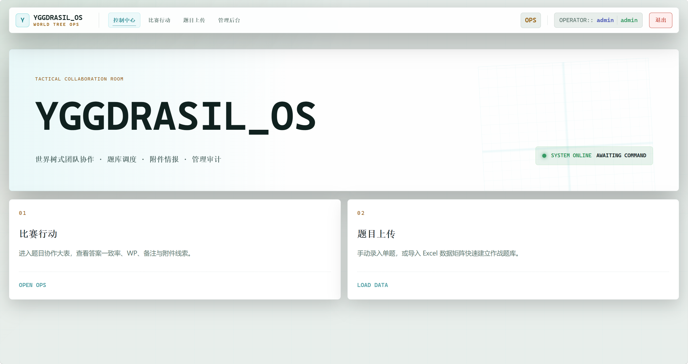

### 4. 比赛行动

比赛行动用于隔离不同比赛或训练场景。每个比赛拥有独立编码、题目集合和协作大表。

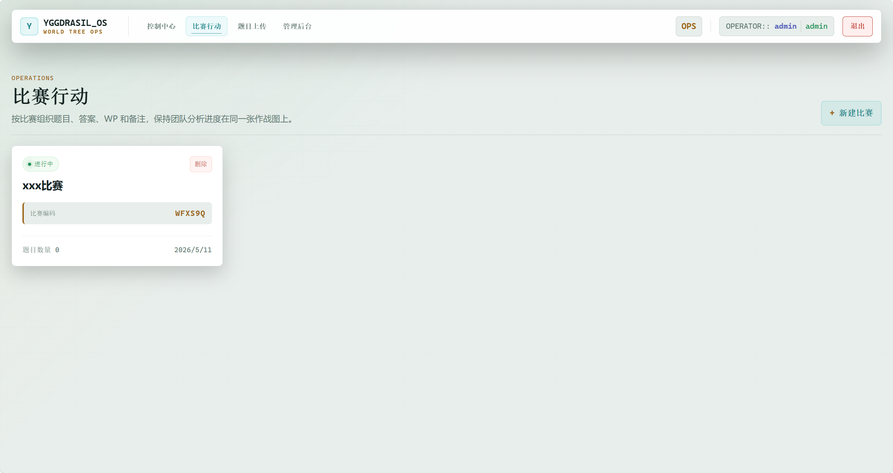

创建比赛：

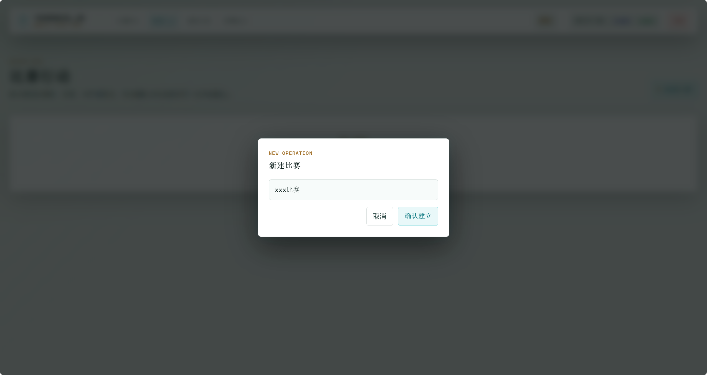

操作说明：

- 点击“新建比赛”创建新的比赛行动。
- 点击比赛卡片进入该比赛的题目协作大表。
- 管理员可以删除比赛，删除前请确认数据已备份。

### 5. 题目上传与测试 Excel

系统支持两种题目录入方式：

- 手动上传单道题目。
- 上传 Excel 批量导入题目。

测试用例 Excel 已放在：

```text
docs/testdata/yggdrasil_sample_tasks.xlsx
```

Excel 说明：

- `Tasks` 工作表：用于批量建题，前两列为 `题目ID`、`题目内容`，可直接上传。
- `BatchUpdate` 工作表：用于演示批量回传答案、WP 和备注。
- `Readme` 工作表：说明字段含义。

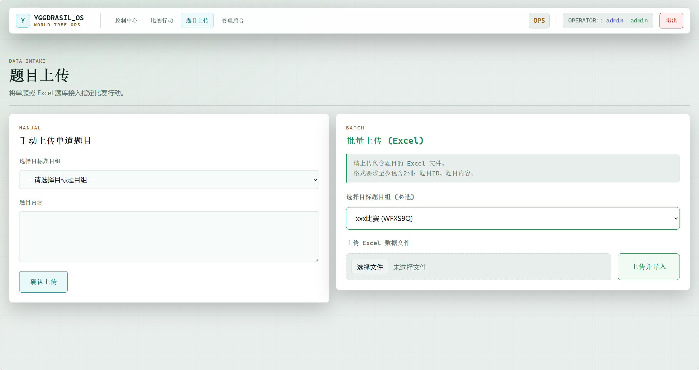

### 6. 答题协作大表

协作大表是日常工作区，支持：

- 按题目 ID 和题目内容筛选。
- 提交答案。
- 提交 WP。
- 提交备注。
- 上传 WP 附件。
- 查看答案分布和最终候选答案。
- 导出数据矩阵。
- 下载提交模板并批量回传。

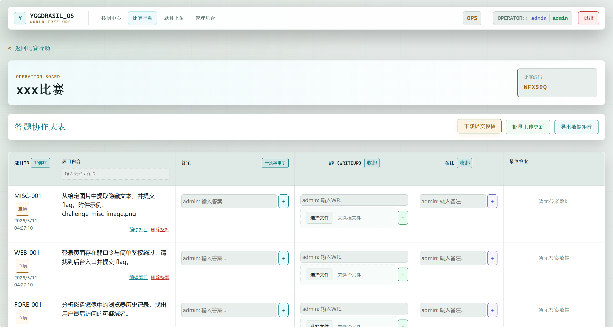

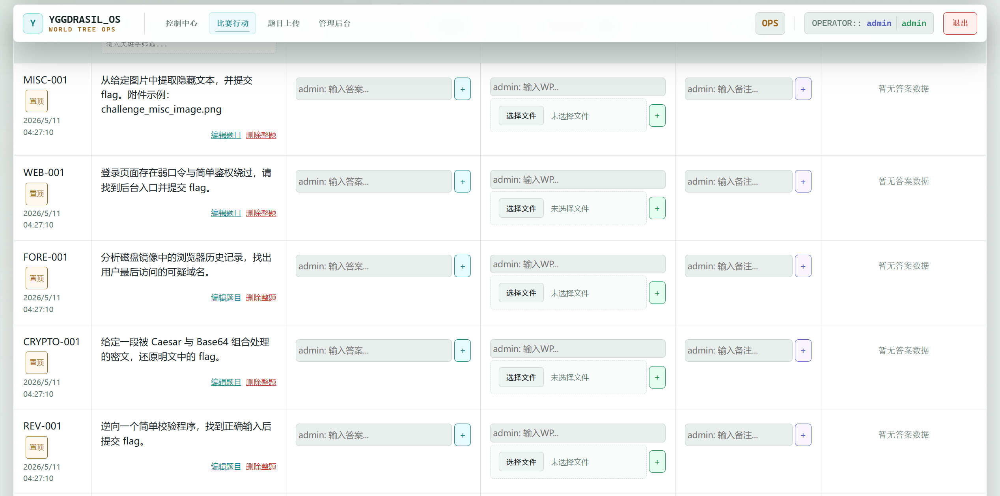

### 7. 题目详情与附件下载

题目详情页用于查看单题内容、答案、WP、备注和附件。

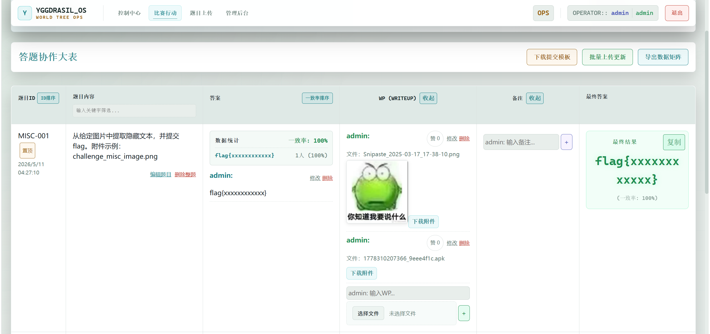

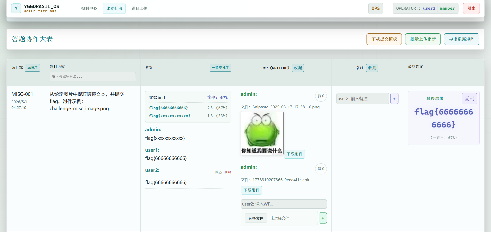

### 8. 管理员战情室

管理员登录后，顶部导航会出现“管理后台”，也可以直接访问：

```text
http://localhost:3000/admin
```

管理员后台集中管理系统态势、用户、邀请码、比赛、附件、备份、配置和审计日志。

#### 8.1 概览

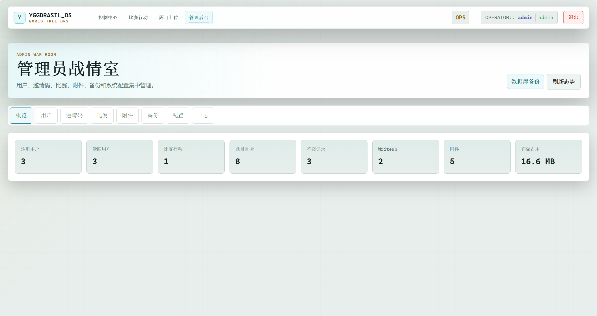

#### 8.2 用户管理

管理员可以查看已注册用户、修改角色、启用/禁用账号、重置密码。

当前管理员账号不能把自己降级为 `member`，也不能禁用自己，避免失去后台入口。

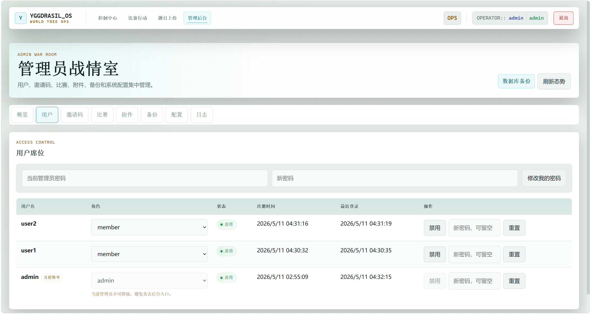

#### 8.3 邀请码管理

管理员可以创建、启用、禁用邀请码，并设置使用次数和备注。

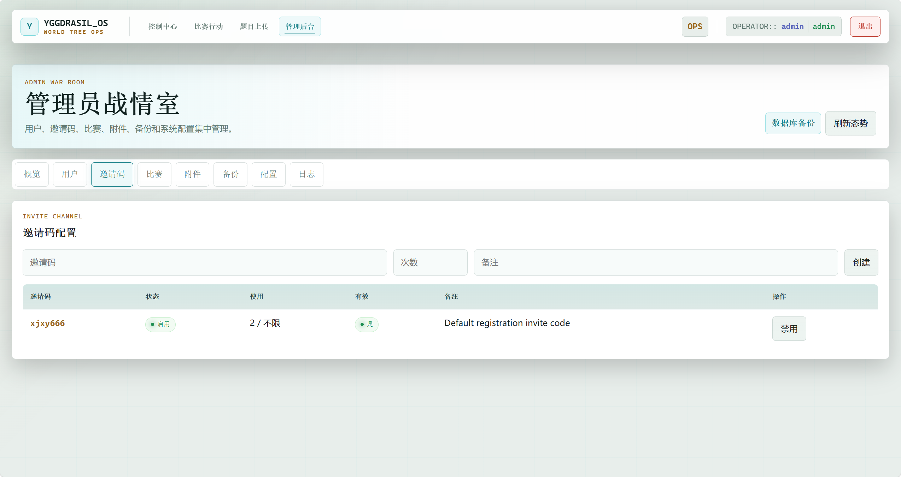

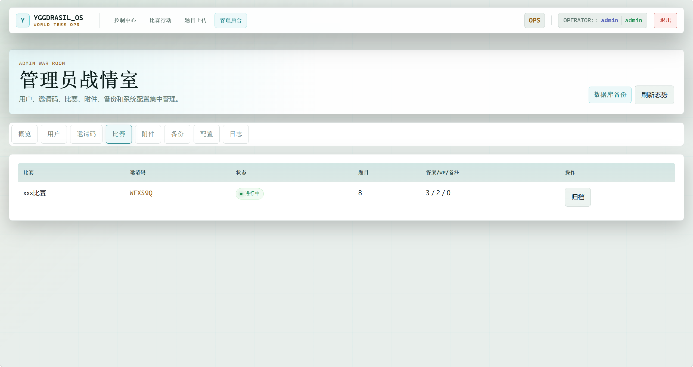

#### 8.4 附件管理

后台附件页可以查看附件数量、占用空间、孤立附件，并下载附件。

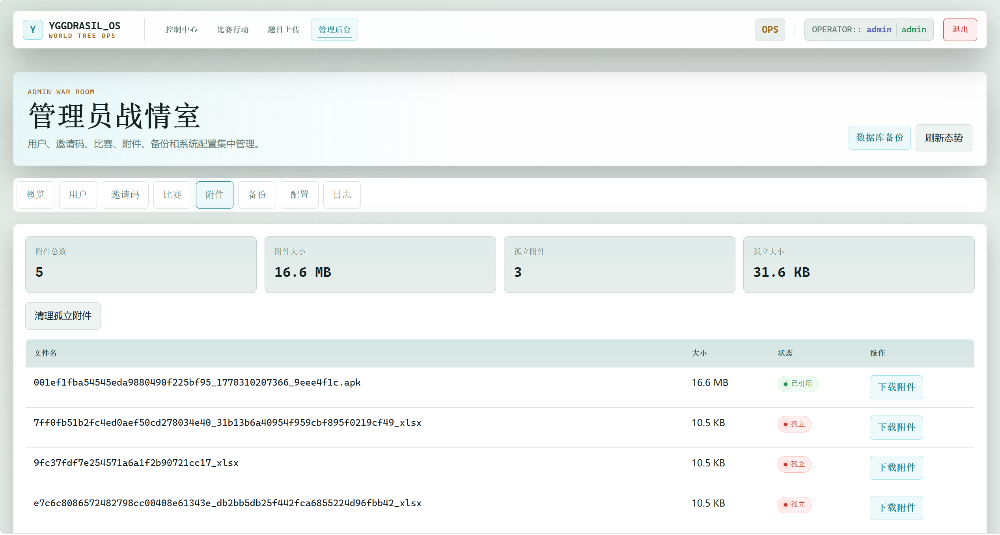

#### 8.5 系统配置与日志

管理员可以调整注册开关、默认角色、上传上限、会话有效期、普通用户权限和系统公告，并查看审计日志。

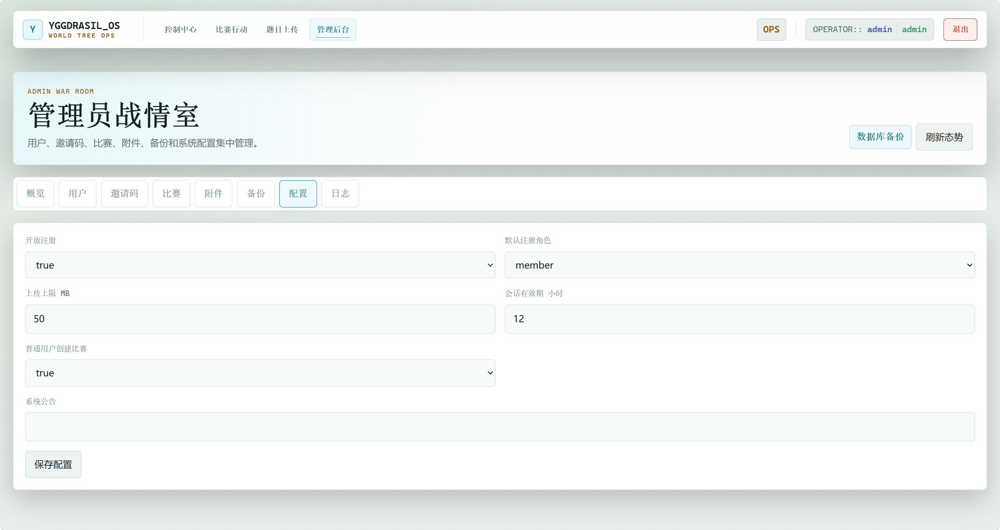

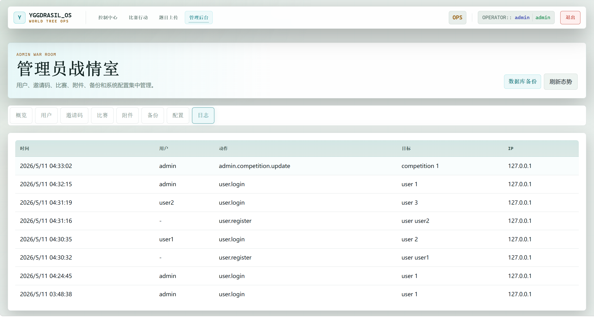

## 主要 API

| 方法 | 路径 | 说明 |
| --- | --- | --- |
| POST | `/api/register` | 注册用户 |
| POST | `/api/login` | 登录并获取 token |
| GET | `/api/admin/overview` | 管理后台概览，管理员权限 |
| GET | `/api/admin/users` | 用户列表，管理员权限 |
| PATCH | `/api/admin/users/<id>` | 修改用户角色或状态，管理员权限 |
| POST | `/api/admin/users/<id>/reset-password` | 重置用户密码，管理员权限 |
| POST | `/api/admin/change-password` | 修改当前管理员密码 |
| GET | `/api/admin/invite-codes` | 邀请码列表，管理员权限 |
| POST | `/api/admin/invite-codes` | 创建邀请码，管理员权限 |
| PATCH | `/api/admin/invite-codes/<id>` | 更新邀请码，管理员权限 |
| GET | `/api/admin/competitions` | 后台比赛列表，管理员权限 |
| PATCH | `/api/admin/competitions/<id>` | 归档/更新比赛，管理员权限 |
| GET | `/api/admin/storage` | 附件存储扫描，管理员权限 |
| DELETE | `/api/admin/storage/orphans` | 清理孤立附件，管理员权限 |
| GET | `/api/admin/backup/database` | 下载 SQLite 数据库备份，管理员权限 |
| GET | `/api/admin/settings` | 系统设置，管理员权限 |
| PATCH | `/api/admin/settings` | 更新系统设置，管理员权限 |
| GET | `/api/admin/audit-logs` | 审计日志，管理员权限 |
| GET | `/api/competitions` | 获取比赛列表 |
| POST | `/api/competitions` | 创建比赛 |
| GET | `/api/competitions/<id>` | 获取比赛详情 |
| DELETE | `/api/competitions/<id>` | 删除比赛，管理员权限 |
| POST | `/api/tasks/upload` | Excel 批量导入题目 |
| POST | `/api/tasks/single` | 手动创建单题 |
| GET | `/api/tasks` | 获取题目列表 |
| GET | `/api/tasks/<task_id>` | 获取题目详情 |
| PUT | `/api/tasks/<task_id>` | 编辑题目，管理员权限 |
| DELETE | `/api/tasks/<task_id>` | 删除题目，管理员权限 |
| POST | `/api/tasks/<task_id>/answer` | 提交或更新答案 |
| POST | `/api/tasks/<task_id>/wp` | 提交 Writeup，可带附件 |
| POST | `/api/tasks/<task_id>/note` | 提交备注 |
| POST | `/api/items/<type>/<id>/like` | 点赞或取消点赞 |
| GET | `/api/stream` | SSE 实时刷新通道 |


## 数据位置

- SQLite 数据库：默认位于 `backend/instance/yggdrasil_os.db`。如果仅存在旧版 `backend/instance/cavali_ctf.db`，后端会自动兼容旧库。
- Writeup 附件：`backend/uploads/wps/`

重建数据库会清空已有数据：

```powershell
cd "<项目目录>\backend"
python recreate_db.py
```

## 许可证

当前 README 沿用原项目说明中的 MIT License。如需开源发布，建议在仓库根目录补充正式的 `LICENSE` 文件。
